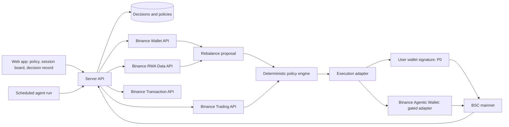

# Bellproof architecture

**Status:** implementation plan, updated 29 September 2026. The dashboard, signed client, market and issuer-profile lookup, wallet-balance proposal, RFQ preview, and pure policy engine exist; persistence and execution remain planned. Upstream Binance calls are not yet verified in this environment because DNS resolution fails.

## Design rule

Give the agent one job: **keep this basket within my policy**. Its proposal can come from observed drift; only the deterministic policy can mark it eligible for execution. Any autonomous executor must also enforce the user's limits outside the language model.



## Proposed stack

- **App:** Next.js and TypeScript for the public dashboard, authenticated policy editor, and server API.
- **Wallet:** a standard BSC wallet connector for P0 owner-signed transactions. Keep wallet code behind an adapter to allow Agentic Wallet later.
- **State:** a small relational database for policies, decision snapshots, and receipt references. Never store wallet private keys.
- **Scheduler:** one persistent job process or managed cron trigger that invokes the same decision service used by the UI. The job must be idempotent by policy, asset, and observation window.
- **Data:** Binance Web3 RWA, Trading, Transaction, and Wallet APIs. A server-only client signs each request with the exact `/build` path and raw query/body bytes used on the wire.

No infrastructure provider or AI model is committed at the planning stage. A language model is optional for readable summaries after the policy outcome is fixed.

## Decision pipeline

```text
observe wallet and target weights
  -> resolve the BSC token and issuer
  -> read market status and restriction reason
  -> propose BUY, SELL, or HOLD from allocation drift
  -> request a fresh quote for the proposed side and size
  -> apply the deterministic policy to status, quote, limits, and preflight
  -> WAIT or BLOCK with evidence, or prepare route-specific execution
  -> for RFQ: build/simulate exact approval if needed; validate typed order
  -> recheck quote age, status, and remaining caps
  -> request user signature or bounded Agentic Wallet execution when verified
  -> submit the route-specific order and verify final status, receipt, and balances
  -> append immutable decision/result record
```

The order matters. A quote is not an authorization. Simulation is not settlement. Every state change is saved with timestamps so the judge can see where a decision stopped.

The Agentic Wallet path is a separate adapter: use its BSC quote, swap, and order-status flow only after checking the same policy and its Binance App security rules. Its returned `orderId` means submission, not completion; poll until a final state and record the actual transaction hash and balances. This path must not be presented as the same RFQ EIP-712 flow until a live stock route proves it. [Agentic Wallet stock-trading guide](https://developers.binance.com/en/docs/products/agentic-wallet/use-cases/trading/stock-trading), [market-order reference](https://github.com/binance/binance-skills-hub/blob/main/skills/binance-web3/binance-agentic-wallet/references/market-order.md).

## External API mapping

| Product need | Binance endpoint family | Notes |
| --- | --- | --- |
| Find same-ticker assets and issuer | RWA search, token list, underlying profile | Filter chain `56`; retain contract, issuer, decimals, `tokenToShareRatio`, and attestation links when present. |
| Observe basket allocation | Wallet token balances by address | Request the chosen BSC stock contract and BSC USDT; value with returned `tokenPrice`; fail closed on a missing price for held tokens or a risk flag. A valuation is not an executable quote. |
| Session and restriction state | RWA underlying market / token list `statusInfo` | Use API status and `nextOpenTime`, not a hand-coded US clock; closures, holidays, and corporate actions differ. |
| Executable cost | Trading aggregated quote | A quote ID lasts about 30 seconds; compare output after share-ratio normalization and known fees. Present issuer rights and protections separately; equal share exposure does not imply legally equivalent tokens. No route means no trade. |
| RFQ order construction | Trading swap endpoint returns `rfq.typedDataToSign` for equity routes | Re-quote before construction; verify chain, wallet, token, amount, deadline, and vendor fields before EIP-712 signing. |
| Approval preflight | Trading approval endpoint and Transaction simulation | For ERC-20 approval, enforce exact amount and vendor spender; simulate the approval transaction. RFQ orders themselves are not on-chain transactions to simulate through the Transaction API. |
| Order submission | Trading RFQ order submit/status endpoints | Submit only the user-signed order and track its actual state; a signature is not settlement. |
| Portfolio and post-trade state | Wallet balances / transaction status | Verify mined receipt and updated token balance before marking a trade complete. |

References: [RWA](https://web3.binance.com/en/dev-docs/catalog/web3-wallet/api/rest-api/rwa-data), [Trading](https://web3.binance.com/en/dev-docs/catalog/web3-wallet/api/rest-api/trading-api), [Transaction](https://web3.binance.com/en/dev-docs/catalog/web3-wallet/api/rest-api/transaction-api), [Wallet](https://web3.binance.com/en/dev-docs/catalog/web3-wallet/api/rest-api/wallet-api).

## Security and execution boundaries

1. **Credentials:** Binance API key and secret stay on the server. Sign `timestamp + METHOD + /build/path?query + rawBody` using HMAC-SHA256, Base64 encoded. Never expose credentials in browser bundles, logs, or public decision records. [Binance authentication](https://web3.binance.com/en/dev-docs/authentication).
2. **No private-key custody in P0:** the user signs an exact approval transaction if needed and the RFQ EIP-712 order in their wallet. The server prepares and checks but cannot sign for the user.
3. **Allowlist and limits:** chain `56`, recognized token addresses, approved router/spender, exact or bounded ERC-20 approval, trade size, daily budget, slippage, quote impact, and cooldown are checked before and immediately before signing.
4. **Fail closed:** unknown status, stale RWA data, stale quote, no route, failed approval simulation, unexpected approval target, or disagreement between the displayed quote and typed order causes `BLOCK` or `WAIT`.
5. **No AI authority:** a model may explain a decision from structured facts. It cannot choose an unapproved token, edit a cap, sign, or call execution directly.
6. **Autonomous P1:** only add Binance Agentic Wallet after verifying the team's account setup, token scope, daily limits, and approval flow. Its security rules are configured in the Binance App, according to [its documentation](https://developers.binance.com/en/docs/products/agentic-wallet/quickstart/install-agentic-wallet).

## Data records

`Policy`: wallet address, chain, target weights, token/issuer allowlist, regular and outside-hours limits, cooldown, enabled sessions, version, updated time.

`Observation`: observed time, source response time, ticker, contract, issuer, session, `openState`, reason code, next open, wallet balance, target drift, quote ID/time, route, output amount, price impact/fee fields if supplied.

`Decision`: policy version, observation references, action, ordered reason codes, selected and rejected alternatives, expected exposure, preflight status, signer mode, immutable content hash, created time.

`Execution`: decision ID, approval transaction if any, RFQ order ID and status, settlement transaction hash if available, actual balance delta, verified time, failure reason.

Public views redact wallet-sensitive details where appropriate but retain enough data and source links to reproduce the decision. A database decision hash is an audit aid; it is **not** an on-chain proof unless explicitly anchored in a transaction.

## Failure and replay tests

- Session moves from `regular` to `closed` between observation and signing: refresh state and wait.
- Asset moves to `ASSET_PAUSED`: block even if an older quote exists.
- Quote expires or route disappears: re-quote; never reuse an expired ID.
- Approval spender or amount differs from what the UI displayed: block.
- Approval simulation succeeds but the approval reverts, or an RFQ order fails after signing: record a failed execution, not a successful trade.
- Scheduler retries the same window: idempotency key prevents duplicate orders.
- Two issuer tokens represent different share ratios: normalize before comparison; never compare raw token counts.
- API 401/429/5xx, timestamp drift, or missing fields: log a concise reason and wait without spending.

## Open decisions to resolve with live evidence

1. Which BSC stock ticker has a usable route for a small live mainnet trade?
2. Does the same ticker have executable bStocks and Ondo routes? If not, omit issuer comparison from the P0 demo.
3. Does Agentic Wallet expose a practical automation path for our app by the P1 gate? If not, retain user-signed execution and skip the special-prize claim.
4. Which deployment host can run the scheduler and server-side Binance signing reliably through judging?
